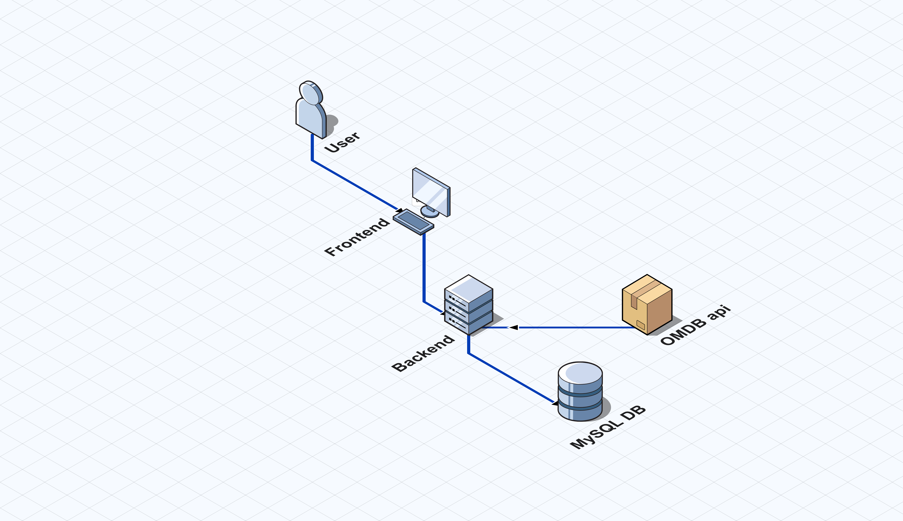

# Movie Comparison App

A full-stack application that allows users to search movies using the OMDB API, compare them side-by-side, and save selected movies into a persistent watchlist.

## Architecture Overview



This project follows a monorepo structure with separated frontend and backend applications to maintain clear boundaries and scalability.

```
movie-compare-app/
│
├── backend/      → Node.js + Express + Sequelize + MySQL
├── frontend/     → React + Zustand + MUI
└── README.md     → General documentation
```

#### High-Level Architecture

Client → Backend API → OMDB API
Client → Backend API → MySQL Database

#### Architectural Decisions

- The frontend does not call OMDB directly.
- The backend acts as a proxy and integration layer.
- The database stores only persistent application data (watchlist).

#### Why this architecture?

- Centralized API integration
- Better security (API keys not exposed)
- Easier future scalability (caching, logging, rate limiting)
- Cleaner separation of concerns

## Tech Stack

#### Backend

- Node.js
- Express
- Sequelize (ORM)
- MySQL
- Jest (unit & integration testing)
- ESLint + Prettier

#### Frontend

- React (Hooks, ES6)
- Zustand (state management)
- MUI (styling)
- Vitest (unit testing)

#### Tooling

- Yarn
- Docker (for MySQL containerized setup)

## How to Run

## Future Improvements
